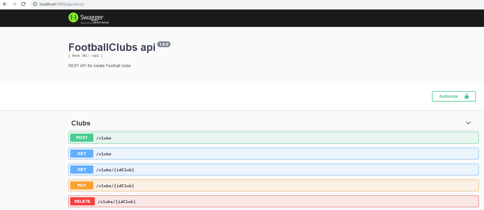

# FootballClubs API


## About project
This project is a API/REST developed with the following technologies:

- [nodeJs](https://nodejs.org/en)
- [express](https://expressjs.com)
- [express-validator](https://github.com/validatorjs/validator.js)
- [mongoose](https://mongoosejs.com)
- [swagger](https://swagger.io/)

## Setup
### Installation
Clone this repo to your local machine using
```
git clone https://github.com/jabez/nodejs_footballclubs_api.git
```
Install the dependencies
```
yarn
```
 - **NOTE:** add your connection MongoDB in ``` config/database```
### Run
To run this project
```
yarn dev
```
Navigate to `http://localhost:3000/api/docs`
